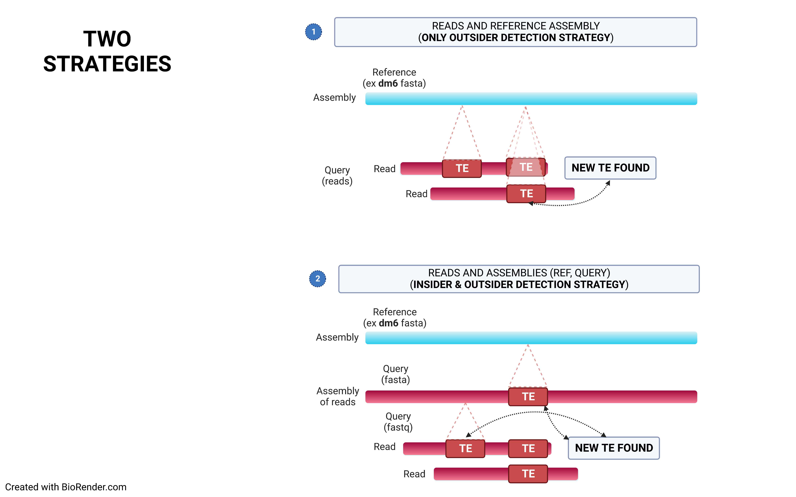
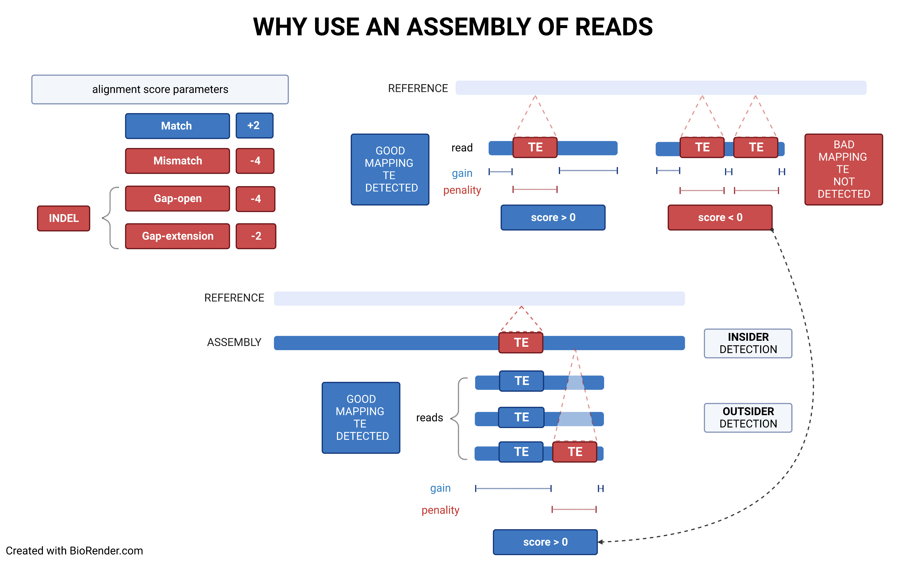
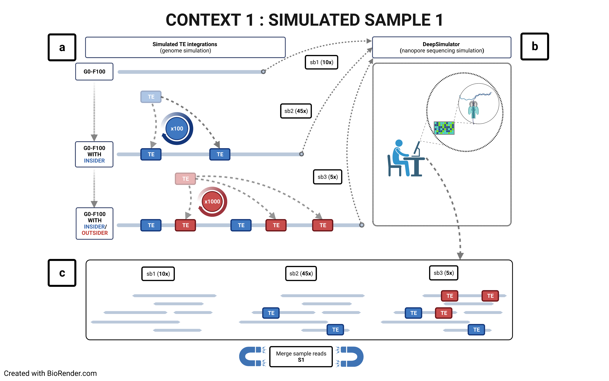
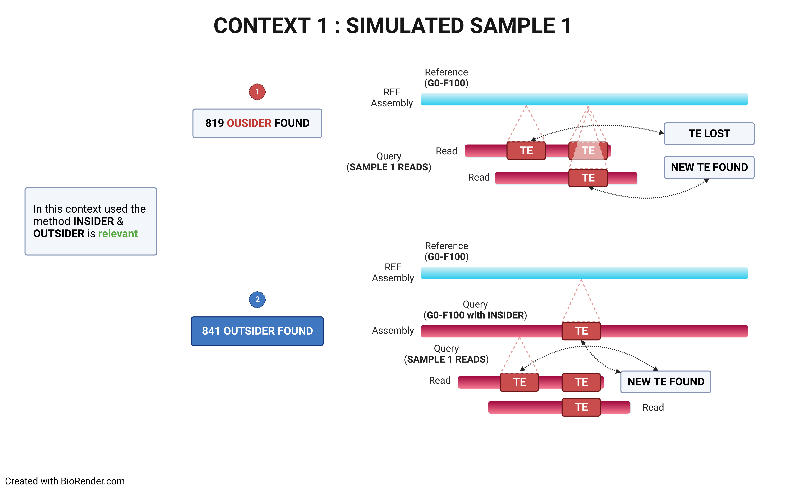
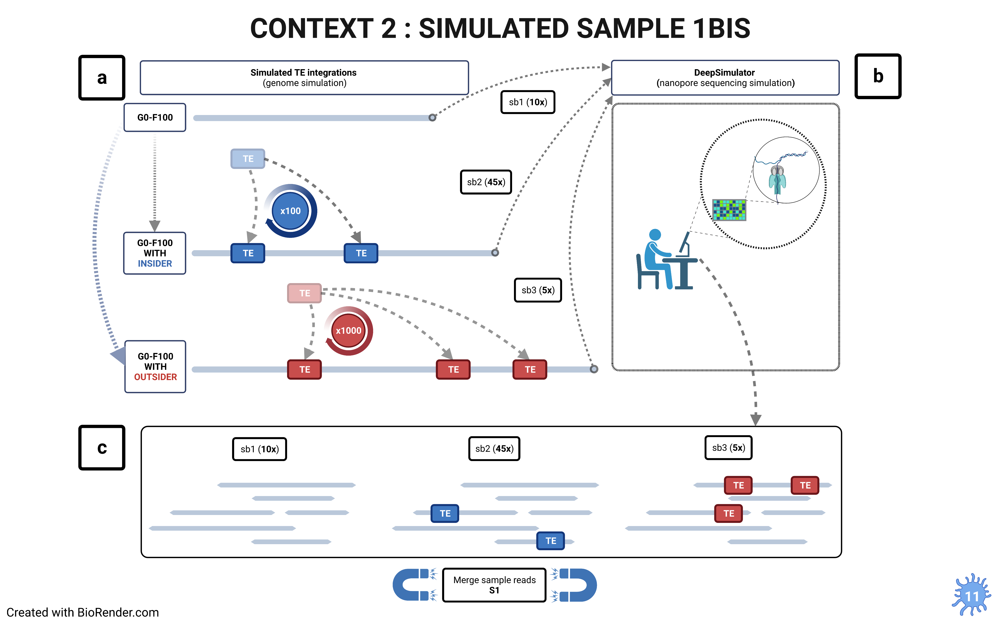
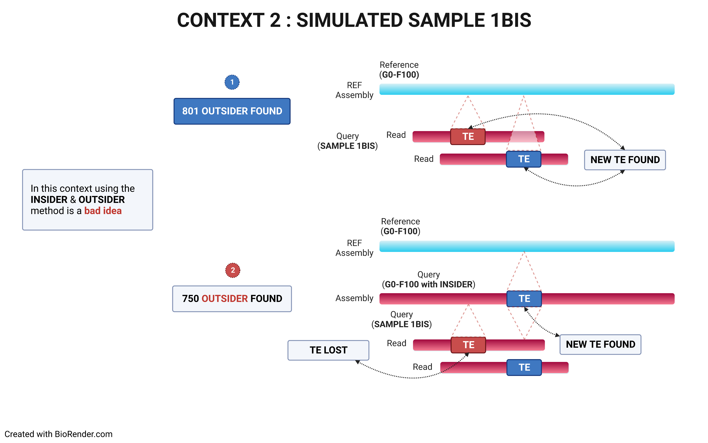

[](https://singularity-hub.org/collections/5391)


- [Introduction](#introduction)
    - [Global variations](#in)
    - [Populational variations](#out)
- [Release note](#release)
- [Requirements](#requirements)
- [Installation](#installation)
    - [Using Git](#git)
    - [Using Singularity](#singularity)
- [Configuration](#configuration)
- [Usage](#usage)
- [Output files](#output)
- [Assembly correction utilities](#assembly-correction)
- [Modules](#modules)
    - [Scatter Frequency](#module-1)
    - [ANALYSYS TE BLAST](#module-2)
- [strategies](#how_to_use)
- [Citation & Licence](#citation)


# TrEMOLO<a name="introduction"></a>
**Transposable Elements MOvement detection using LOng reads**

TrEMOLO uses long reads, either directly or through their assembly, to detect:
- Global TE variations between two assembled genomes
- Populational/somatic variations in TE insertions/deletions

## Global variations, the insiders<a name="in"></a>

Using a reference genome and an assembled one (preferentially using long contigs or even better a chrosomome-scale assembly), TrEMOLO will extract the **insiders**, *i.e.* variant transposable elements (TEs) present globally in the assembly, and tag them. Indeed, assemblers will provide the most frequent haplotype at each locus, and thus an assembly represent just the "consensus" of all haplotypes present at each locus.
You will obtain a [set of files](#output) with the location of these variable insertions and deletions.

## Populational variations, the outsiders<a name="out"></a>

Through remapping of reads that have been used to assemble the genome of interest, TrEMOLO will identify the populational variations (and even somatic ones) within the initial dataset of reads, and thus of DNA/individuals sampled. These TE variants are the **outsiders**, present only in a part of the population or cells.
In the same way as for insiders, you will obtain a [set of files](#output) with the location of these variable insertions and deletions.


## Release Notes<a name="release"></a>

**Version 2.5.6**

* **Change : Output files**
  * Add deletion `INSIDER` to `TE_INFOS.bed`
  * Add new output file : `MULTIPLE_TE_BY_ID.txt` Sometimes loci contain several different TE families (for example, when working with a population).
    This can be shown in the file listing the insertion ID, the TE name, and the count.

* **Add : New Parameters in config.yaml**
  * TIME_LIMIT : time limit for processing SV detection (rule TrEMOLO_SV_TE); put value >= 0 (hours); 0 means no time limit

**Warning:** : *The Singularity definition file is currently unreliable and may fail to build the environment. Please use the pre-compiled image (e.g., [TrEmOLO.simg](https://github.com/DrosophilaGenomeEvolution/TrEMOLO/releases/download/v2.5.4b/TrEMOLO.simg)) instead.*


## Current limitations

* In **INSIDER_VARIANT** mode, TE annotation on the **REFERENCE** (parameter **INTEGRATE_TE_TO_GENOME**) is suboptimal. Some TEs might not be annotated on the reference.

* Difficulty in identifying the true positives concerning clipped insertions (SOFT, HARD)


## Upcoming Features

**Comprehensive TE Analysis**

In our upcoming release, we will be expanding our analysis capabilities to include a comprehensive examination of Transposable Elements (TEs) within both reads and genomes. This enhancement will go beyond merely identifying INDELs to encompass a full spectrum analysis of TEs.


# Requirements<a name="requirements"></a>

Numerous tools are used by TrEMOLO. We recommand to use the [Singularity installation](#singularity) to be sure to have all of them in the good configurations and versions.

- For both approaches
  - Python 3.6+
- For Global variation tool
  - [BLAST](https://blast.ncbi.nlm.nih.gov/Blast.cgi?CMD=Web&PAGE_TYPE=BlastDocs&DOC_TYPE=Download) 2.2+
  - [Bedtools 2.27.1](https://bedtools.readthedocs.io/en/latest/) v2
  - [Assemblytics](http://assemblytics.com/) or
  - [RaGOO](https://github.com/malonge/RaGOO)
  - [Liftoff](https://github.com/agshumate/Liftoff)
- For Populational variation tool
  - [Snakemake](https://snakemake-wrappers.readthedocs.io/en/stable/) 5.5.2+
  - [Minimap2](https://github.com/lh3/minimap2) 2.24+
  - [Samtools](http://www.htslib.org/) 1.9 and (1.15.1 optional)
  - [svim 1.4.2](https://github.com/eldariont/svim/releases/tag/v1.4.2)
  - [Sniffles 1.0.12](https://github.com/fritzsedlazeck/Sniffles/releases/tag/v1.0.12b)
  - Python libs
    - [Biopython](https://biopython.org/)
    - [Pandas](https://pandas.pydata.org/)
    - [Numpy](https://numpy.org/) 1.21.2
    - [pylab](https://matplotlib.org/)
    - [intervaltree](https://pypi.org/project/intervaltree/)
    - [pysam](https://pypi.org/project/pysam/)
  - Perl v5.26.2+
- For report
  - The refactored `workflow/Snakefile` uses [Quarto](https://quarto.org/) 1.9.36
    and embedded browser JavaScript; it does not require R or network access at
    render time. The R packages below remain requirements of the legacy
    `run.snk`/Bookdown report only.
  - R 3.3+ libs
    - [knitr 1.38](https://www.r-project.org/nosvn/pandoc/knitr.html)
    - [rmarkdown 2.26](https://rmarkdown.rstudio.com/)
    - [bookdown 0.38](https://bookdown.org/yihui/bookdown/get-started.html)
    - [viridis 0.6.2](https://www.rdocumentation.org/packages/viridis/versions/0.3.4)
    - [viridisLite 0.4.0](https://github.com/sjmgarnier/viridisLite)
    - [rjson 0.2.20](https://rdrr.io/cran/rjson/)
    - [ggthemes 4.2.4](https://github.com/jrnold/ggthemes)
    - [forcats 0.5.1](https://rdrr.io/cran/forcats/)
    - [reshape2 1.4.4](https://www.r-project.org/nosvn/pandoc/dplyr.html)
    - [dplyr 1.0.8](https://www.r-project.org/nosvn/pandoc/dplyr.html)
    - [kableExtra 1.3.4](https://bookdown.org/yihui/rmarkdown-cookbook/kableextra.html)
    - [extrafont 0.17](https://cran.r-project.org/web/packages/extrafont/README.html)
    - [ggplot2 3.4.2](https://ggplot2.tidyverse.org/)
    - [RColorBrewer 1.1-2](https://www.rdocumentation.org/packages/RColorBrewer/versions/1.1-2=)       
    - [stringr 1.4.0](https://cran.r-project.org/web/packages/stringr/index.html)
    - [stringi 1.7.6](https://cran.r-project.org/web/packages/stringi/index.html)
  - [pandoc-citeproc 0.17](https://github.com/jgm/citeproc)
- Others
  - nodejs


# Installation<a name="Installation"></a>

## Using Git<a name="git"></a>

Once the requirements fullfilled, just *git* clone

```bash
git clone https://github.com/DrosophilaGenomeEvolution/TrEMOLO.git
```

## Using Singularity<a name="singularity"></a>


[*Singularity* installation Debian/Ubuntu with package](https://sylabs.io/guides/3.0/user-guide/installation.html#install-the-debian-ubuntu-package-using-apt)

### Compiling yourself
A [*Singularity* container](https://sylabs.io/) (version 3.10.0+ required) is available with all tools compiled in.
The *Singularity* file provided in this repo and can be compiled as such:

```bash
sudo singularity build TrEMOLO.simg TrEMOLO/Singularity
```

**YOU MUST BE ROOT for compiling**


Alternatively, you can download a pre-compiled Singularity container from the following link:

[Download TrEMOLO Singularity Container](https://github.com/DrosophilaGenomeEvolution/TrEMOLO/releases/download/v2.5.4b/TrEMOLO.simg)


Test TrEMOLO with singularity (from the parent directory of the checkout)

```bash
singularity exec TrEMOLO.simg snakemake \
  --snakefile TrEMOLO/workflow/Snakefile \
  --configfile TrEMOLO/tests/workflow/refactor_config.yml --cores 8 all
```


The report requires Quarto. Check the image before running:

```bash
singularity exec TrEMOLO.simg snakemake --version
singularity exec TrEMOLO.simg quarto --version
singularity exec TrEMOLO.simg /opt/conda/envs/liftoff_env/bin/liftoff --version
```

Older images may lack Quarto. If Quarto is installed at `/opt/quarto` on the
host, the complete workflow can use it through a read-only bind:

```bash
singularity exec --bind /opt/quarto:/opt/quarto:ro TrEMOLO.simg snakemake \
  --snakefile TrEMOLO/workflow/Snakefile \
  --configfile TrEMOLO/tests/workflow/refactor_config.yml --cores 8 all
```

The fixture sets `TOOLS.LIFTOFF: /opt/conda/envs/liftoff_env/bin/liftoff`
and `TOOLS.QUARTO: /opt/quarto/bin/quarto`. For other installations,
set this configuration value to the executable available inside the container.
The repository container definition installs Quarto 1.9.36; existing images
are not updated by editing that definition.

### Pulling from SingularityHub

This option is disabled since Singularity Hub is for the moment in read-only. We are looking for a Singularity repo to ease the use.


# Configuration of the parameter file<a name="configuration"></a>

TrEMOLO uses [Snakemake](https://snakemake-wrappers.readthedocs.io/en/stable/) to perform its analyses. You have then first to provide your parameters in a *.yaml* file (see an example in the *config.yaml* file). Parameters are :

```yaml
# all path can be relative or absolute depending of your tree.
#It is advised to only use absolute path if you are not familiar with computer science or the importance of folder trees structure.
DATA:
    GENOME:          "/path/to/genome_file.fasta"      #genome (fasta file) [required]
    TE_DB:           "/path/to/database_TE.fasta"      #Database of TE (a fasta file) [required]
    REFERENCE:       "/path/to/reference_file.fasta"   #reference genome (fasta file) only if INSIDER_VARIANT = True [optional]
    SAMPLE:          "/path/to/reads_file.fastq"       #long reads (a fastq[.gz] file) only if OUTSIDER_VARIANT = True [optional]
    #At least, provide either REFERENCE or SAMPLE. Both can be provided
    WORK_DIRECTORY:  "/path/to/directory"         #name of output directory [optional, will be created as 'TrEMOLO_OUTPUT']

#At least, you must provide either the reference file, or the fastq file or both

CHOICE:
    PIPELINE:
        OUTSIDER_VARIANT: True  # outsiders, TE not in the assembly - population variation
        INSIDER_VARIANT: True   # insiders, TE in the assembly
        TE_GENOME: False        # resident TE annotation across complete assemblies
        REPORT: True            # for getting a report.html file with graphics
    OUTSIDER_VARIANT:
        CALL_SV: "sniffles"     # possibilities for SV tools: sniffles, no_sniffles
        INTEGRATE_TE_TO_GENOME: True # (True, False) Re-build the assembly with the OUTSIDER integrated in
        CLIPPED_READS: False # (True, False) Processing of clipped reads (SOFT, HARD)
    INTERMEDIATE_FILE: True     # Conserve the intermediate analyses files to process them latter.


PARAMS:
    THREADS: 8 #number of threads for some task
    TE_GENOME:
        TARGETS: ["GENOME"] # optionally add REFERENCE
        CHROM_KEEP: "."
        MIN_PIDENT: 65
        MIN_ALIGNED_BP: 80
        MAX_EVALUE: 1e-10
        FULL_LENGTH_COVERAGE: 80 # classification only; partial copies are retained
        PARTIAL_COVERAGE: 20
    OUTSIDER_VARIANT:
        MINIMAP2:
            PRESET_OPTION: 'map-ont' # minimap2 option is map-ont by default (map-pb, map-ont)
            OPTION: '' # more option of minimap2 can be specified here
        SAMTOOLS_VIEW:
            PRESET_OPTION: ''
        SAMTOOLS_SORT:
            PRESET_OPTION: ''
        SAMTOOLS_CALLMD:
            PRESET_OPTION: ''
        TSD:
            SIZE_FLANK: 15  # flanking sequence size for calculation of TSD; put value > 4
        LIFT_OFF:
            FLANK_SIZE: 100000 # flank projected on each side of an integrated TE
            MAX_GAP: 20000     # maximum accepted interval/overlap on the reference
        TE_DETECTION:
            CHROM_KEEP: "." # regular expresion for chromosome filtering; for instance for Drosophila  "2L,2R,3[RL],X" ; Put "." to keep all chromosome
            GET_SEQ_REPORT_OPTION: "-m 30" #sequence recovery file in the vcf
            TIME_LIMIT: 0 # time limit for processing SV detection (rule TrEMOLO_SV_TE); put value >= 0 (hours); 0 means no time limit
        PARS_BLN_OPTION: "--min-size-percent 80 --min-pident 80 -k 'INS|DEL'" # option for TrEMOLO/lib/python/parse_blast_main.py - don't put -c option
    INSIDER_VARIANT:
        PARS_BLN_OPTION: "--min-size-percent 80 --min-pident 80" # parameters for validation of insiders
        MINIMAP2:
            PRESET_OPTION: 'asm5' # minimap2 preset option is asm5 by default (asm5, asm10, asm20 etc)
            OPTION: '--cs'


```

When `INTEGRATE_TE_TO_GENOME` is enabled, TrEMOLO writes both the canonical
reconstruction (`OUTSIDER/TE_TOWARD_GENOME/PSEUDO_GENOME_TE_DB_ID.fasta`) and
the reconstruction based on observed SV sequences (`NEO_GENOME.fasta`). The
corresponding shifted BED files and `INTEGRATION_TE.tsv` make every inserted or
rejected event explicit. If INSIDER is also enabled, the two flanks of each
integrated insertion are projected to the reference with Liftoff; concordant
calls are written to `POS_TE_OUTSIDER_ON_REF.bed`, while uncertain mappings and
their reasons remain available in `BAD_POS_TE_LIFT.bed` and
`OUTSIDER/INSIDER_VR/LIFT_OFF_AUDIT.tsv`.

The main parameters are:

- `GENOME` : Assembly of the sample of interest (or mix of samples), fasta file.
- `TE_DB`  : A **Multifasta** file containing the canonical sequence of transposable elements. You can add also copy sequences but results will be more complex to interpretate.
- `REFERENCE` : Fasta file containing the reference genome of the species of interest.
- `WORK_DIRECTORY` : Directory that will contain the output files. If the directory does not exist it will be created;  default value is **TrEMOLO_OUTPUT**.
- `SAMPLE` : File containing the reads used for the sample assembly.


You can use **config_INSIDER.yaml** for only **INSIDER** analysis or **config_OUTSIDER.yaml** for only **OUTSIDER** analysis.
To analyse **INSIDER**, only the `REFERENCE` , the `GENOME`, the `TE_DB` and the `WORK_DIRECTORY` are required.
To analyse **OUTSIDER**, only the `SAMPLE` , the `GENOME`, the `TE_DB` and the `WORK_DIRECTORY` are required.


# Usage<a name="usage"></a>

```bash
snakemake --snakefile /path/to/TrEMOLO/workflow/Snakefile \
  --configfile /path/to/your_config.yaml --cores 8 all
```

The supported entry point on this branch is `workflow/Snakefile`. See the
[clean migration validation](docs/migration-validation.md) for the tested
environment and results. The historical
`run.snk` remains available for reproducing legacy runs. Paths in the YAML file
are resolved from the current working directory; the bundled example below is
run from the parent directory of `TrEMOLO`. Use a fresh `DATA.WORK_DIRECTORY`
when switching from the legacy workflow.

For running the bundled fixture

```bash
snakemake --snakefile TrEMOLO/workflow/Snakefile \
  --configfile TrEMOLO/tests/workflow/refactor_config.yml --cores 8 all
```


# Output files summary :open_file_folder:<a name="output"></a>

Here is the structure of the output files obtained after running the pipeline.

```
WORK_DIRECTORY
├── params.yaml  ##**Your config file
├── LIST_HEADER_DB_TE.csv ##** list of names assigned to TE in the TE database (Only if you have charactere "& ; / \ | ' : ! ? " in your TE database)
├── POSITION_ALL_TE.bed -> TE_GENOME/GENOME/POSITION_ALL_TE.bed ## resident TE components when TE_GENOME is enabled
├── POSITION_TE_INOUTSIDER.bed
├── POSITION_TE_INSIDER.bed
├── POSITION_TE_OUTSIDER.bed
├── POS_TE_INSIDER_ON_REF.bed -> INSIDER/TE_DETECTION/INSERTION_TE_ON_REF.bed ##**POSITION TE INSIDER ON REFRENCE GENOME
├── POS_TE_OUTSIDER_ON_REF.bed ##**POSITION TE OUTSIDER ON REFRENCE GENOME
├── POSITION_TE_OUTSIDER_IN_NEO_GENOME.bed  ##**POSITION TE SEQUENCE ON BEST READS SUPPORT INTEGRATED IN GENOME
├── POSITION_TE_OUTSIDER_IN_PSEUDO_GENOME.bed  ##**POSITION TE SEQUENCE ON TE DATABASE (with ID) INTEGRATED IN GENOME
├── VALUES_TSD_ALL_GROUP.csv
├── VALUES_TSD_GROUP_OUTSIDER.csv
├── VALUES_TSD_INSIDER_GROUP.csv
├── TE_CALL_CANDIDATES.tsv ## ambiguous reported calls only; primary plus alternatives
├── MULTIPLE_TE_BY_ID.txt ## legacy run.snk report only
├── TE_INFOS.bed ##**FILE CONTENING ALL INFO OF TE INSERTION
├── TE_GENOME
│   ├── GENOME
│   │   ├── ALL_TE_FRAGMENTS.tsv
│   │   ├── ALL_TE_MATCHES.tsv
│   │   ├── ALL_TE_COPIES.tsv
│   │   ├── ALL_TE_RELATIONS.tsv
│   │   ├── POSITION_ALL_TE.bed
│   │   └── ALL_TE.gff3
│   └── REFERENCE ## optional second target
├── DELETION_TE.bed -> INSIDER/TE_DETECTION/DELETION_TE.bed ##**TE DELETION POSTION ON GENOME
├── DELETION_TE_ON_REF.bed -> INSIDER/TE_DETECTION/DELETION_TE_ON_REF.bed ##**TE DELETION POSITION ON REFERENCE
├── SOFT_TE.bed -> OUTSIDER/TE_DETECTION/SOFT/SOFT_TE.bed ##**TE INSERTION FOUND IN SOFT READS
├── INSIDER ##**FOLDER CONTAINS FILES TRAITEMENT INSIDER
│   ├── FREQ_INSIDER
│   ├── TE_DETECTION
│   ├── TSD
│   │   └── TSD_TE.tsv
│   ├── TE_INSIDER_VR
│   └── VARIANT_CALLING
├── log  ##**log file to check if you have any error
├── OUTSIDER
│   ├── ET_FIND_FA
│   │   ├── TE_REPORT_FOUND_TE_NAME.fasta
│   │   ├── TE_REPORT_FOUND_blood.fasta
│   │   └── TE_REPORT_FOUND_ZAM.fasta
...
│   ├── FREQUENCY
|   |   ├── FREQUENCY_TE_INS_PRECISE.fasta
│   │   └── FREQUENCY_TE_INS.tsv
│   ├── INSIDER_VR
│   ├── MAPPING ##**FOLDER CONTAINS FILES MAPPING ON GENOME
│   ├── MAPPING_TO_REF ##**FOLDER CONTAINS FILES MAPPING ON REFERENCE GENOME
│   ├── TE_DETECTION
│   │   └── MERGE_TE
│   ├── TSD
│   │   └── TSD_TE.tsv
│   ├── TrEMOLO_SV_TE
│   │   ├── INS
│   │   ├── HARD
│   │   └── SOFT
│   ├── TE_TOWARD_GENOME ##**FOLDER CONTAINS ALL THE READs ASSOCIATED WITH THE TE
│   │   ├── NEO_GENOME.fasta   ##**GENOME CONTAINS TE OUTSIDER (the best sequence of svim/sniffles)
│   │   ├── PSEUDO_GENOME_TE_DB_ID.fasta   ##**GENOME CONTAINS TE OUTSIDER (the sequence of database TE and the ID of svim/sniffles)
│   │   ├── TRUE_POSITION_TE_PSEUDO.bed   ##**POSITION IN PSEUDO GENOME
│   │   ├── TRUE_POSITION_TE.fasta  ##**SEQUENCE INTEGRATE IN PSEUDO GENOME
│   │   ├── TRUE_POSITION_TE_NEO.bed  ##**POSITION IN NEO GENOME
│   │   └── TRUE_POSITION_TE_READS.fasta  ##**SEQUENCE INTEGRATE IN NEO GENOME
│   └── VARIANT_CALLING  ##**FOLDER CONTAINS FILES OF sniflles/svim
├── REPORT
│   ├── mini_report
│   └── report.html
├── SNAKE_USED
│   ├── Snakefile_insider.snk
└── └── Snakefile_outsider.snk
```

### Most useful output

The most useful output files are :

* The html report in **your_work_directory/REPORT/report.html** with summary graphics, as shown [here](https://rawcdn.githack.com/DrosophilaGenomeEvolution/TrEMOLO/c10d73fec0455f5e1d00129bd95670f39c9aa0e5/test/web/index.html)

The output file **your_work_directory/TE_INFOS.bed** gathers all the necessary information.

|      chrom      |  start   | end      |   TE\|ID   |   strand  |    TSD     | pident | psize_TE | SIZE_TE |      NEW_POS     |  FREQ (%) | FREQ_OPTIMIZED (%) | SV_SIZE | ID_TrEMOLO  | TYPE |
| --------------- | -------- | -------- | ---------- | --------- | ---------- | --------- | -------- | ------- | ---------------- | ------- | -------------- | -------------- | -------------- | -------------- |
|  2R_RaGOO_RaGOO | 16943971 | 16943972 | roo\|svim.INS.175  |     +     |   GTACA   | 97.026 | 99.2  | 9006    | 16943978 | 28.5714 |    28.5714     | 9000  |  TE_ID_OUTSIDER.94047.INS.107508.0  | INS |
|  X_RaGOO_RaGOO  | 21629415 | 21629416 | ZAM\|Assemblytics_w_534  |     -     |   CGCG  | 98.6 | 90.5  | 8435    | 21629413         | 11.1111 |    10.0000   | 8000  | TE_ID_INSIDER.77237.Repeat_expansion.8 | Repeat_expansion |


 1.    `chrom` : chromosome
 2.    `start` : start position for the TE
 3.    `end` : end position for the TE
 4.    `TE|ID` :   TE name and ID in **SV.vcf**,**SV_SOFT.vcf**,**HARD.fasta** and **SV_INS_CLUST.bed** (for OUTSIDER) or **assemblytics_out.Assemblytics_structural_variants.bed** (for INSIDER)
 5.    `strand` :  strand of the TE
 6.    `TSD` : TSD SEQUENCE
 7.    `pident` : percentage of identical matches with TE
 8.    `psize_TE` : percentage of size with TE in database
 9.    `SIZE_TE` :  TE size
 10.   `NEW_POS` :  position corrected with calculated TSD (only for OUTSIDER)
 11.   `FREQ`  : frequency, normalized
 12.   `FREQ_WITH_CLIPPED`  : frequency with clipped read (OUTSIDER only)
 13.   `SV_SIZE`  : size of the structural variant (may be larger than the size of the TE)
 14.   `ID_TrEMOLO`  : TrEMOLO ID of the TE
 15.   `TYPE`  : type of insertion can be HARD,SOFT (Warning : HARD, SOFT are often false positives),INS,INS_DEL... (INS_DEL is an insertion located on a deletion of the assembly)

# Assembly correction utilities <a name="assembly-correction"></a>

The two reference-guided Bash utilities in `lib/bash` can correct block order,
orientation and chromosome assignment while retaining every query base and
producing a complete audit trail. They now share the same size, MAPQ, identity
and overlap filters. See the
[assembly correction documentation](docs/assembly-correction.md) for their
respective roles, command-line options and output files.

# Modules <a name="modules"></a>

Modules are crucial tools in post-processing for analyses. They enable the extraction and visualization of complex information in an intuitive and accessible manner. With these modules, users can gain a deep understanding of data by directly visualizing outcomes in various graphical formats, thereby facilitating the interpretation and utilization of research results or analyses.

## 1 - Population frequency trajectories <a name="module-1"></a>

This locus-aware module compares TE allele frequencies across generations,
samples and replicates. Missing calls remain missing rather than becoming
frequency zero. It produces normalized observation/trajectory tables and a
self-contained Quarto report. See the
[population module documentation](modules/1-FREQUENCY-MULTI-GENERATIONS/README.md).

## 2 - Insertion structure explorer <a name="module-2"></a>

This module preserves and normalizes every insertion-to-TE BLAST HSP, records
filter decisions and proposes coordinate-supported single, repeated, nested or
multi-TE structures. Evidence is aggregated by TrEMOLO event and linked to
`TE_INFOS.bed` and `TE_CALL_CANDIDATES.tsv`. See the
[structure module documentation](modules/2-MODULE_TE_BLAST/README.md).

Both modules are launched with `./module build <number> ...`; neither requires
R, external JavaScript/CDN assets or a persistent Node server.


# How to use TrEMOLO<a name="how_to_use"></a>

## What strategy to use




## Example of result obtained with simulated data set

The choice of the right strategy depends on the context.

### Context 1 : Strategy 2 is better




### Context 2 : Strategy 1 is better




# Licence and Citation<a name="citation"></a>

Mourdas MOHAMED.

This work is licensed under CC BY 4.0 for all docs and manuals. To view a copy of this license, visit http://creativecommons.org/licenses/by/4.0/

It is licencied under [CeCill-C](Licence_CeCILL-C_V1-en.txt) and [GPLv3](LICENSE).

If you use TrEMOLO, please cite:

Mohamed, M.; Sabot, F.; Varoqui, M.; Mugat, B.; Audouin, K.; Pélisson, A.; Fiston-Lavier, A.-S. & Chambeyron S. TrEMOLO: accurate transposable element allele frequency estimation using long-read sequencing data combining assembly and mapping-based approaches. **Genome Biol** 24, 63 (**2023**). (https://doi.org/10.1186/s13059-023-02911-2)

Mohamed, M.; Dang, N. .-M.; Ogyama, Y.; Burlet, N.; Mugat, B.; Boulesteix, M.; Mérel, V.; Veber, P.; Salces-Ortiz, J.; Severac, D.; Pélisson, A.; Vieira, C.; Sabot, F.; Fablet, M.; Chambeyron, S. A Transposon Story: From TE Content to TE Dynamic Invasion of Drosophila Genomes Using the Single-Molecule Sequencing Technology from Oxford Nanopore. Cells 2020, 9, 1776. (https://www.mdpi.com/2073-4409/9/8/1776)

The data used in the paper are available [here on DataSuds](https://dataverse.ird.fr/dataverse/tremolo_data).
