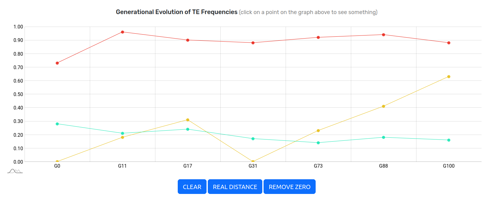

# MODULE SCATTER FREQUENCY TE TrEMOLO


## Input Preparation

To function, this module requires a file containing paths to various analyses performed by TrEMOLO (minimum version +v2.5.1).

Example:

```
/path/to/work_directory_1
/path/to/work_directory_2
/path/to/work_directory_3
```

The order of paths is important as it designates the sequence in which the module will consider generations from oldest to newest.

An alternative solution allows you to manually specify the timing of generations (format work_directory:G[NUMBER]), for 

Example:

```
work_directory_1:G1
work_directory_2:G10
work_directory_3:G3
```

**Recommendation** : Do not exceed 7 paths.

This format indicates the order and the time gap between generations. In the above example, `G1` is the oldest generation, while `G10` is the most recent.

**Info** : The generation numbers (e.g., G2, G10...) enable the module to identify which Transposable Elements (TE) increase, decrease, or vary over generations.


## Run Build Graph

```
singularity exec TrEMOLO.simg TrEMOLO/modules/1-FREQUENCY-MULTI-GENERATIONS/buildFrequencyGenerations.sh -i <input-init-file> [-o OUTPUT-NAME-DIRECTORY] [-g GENOME-FASTA-FILE] [-c REGEX-CHROM]
```

For the module to function:
    * Each work_directory must contain a `TE_INFOS.bed` file (output of TrEMOLO).
    * If the genome is not passed with the -g option, `work_directory/OUTSIDER/FREQUENCY/MAPPING_POSITION_TE.bam` files are necessary.
    * The same genome (GENOME parameter in TrEMOLO) must be used for all `work_directories`.

If you wish to select specific TEs, create a file `work_directory/TE_FREQUENCY_TrEMOLO.bed` in the same format as `TE_INFOS.bed`, including only the `OUTSIDER`.

The [-c REGEX-CHROM] option is useless if you have put `work_directory/TE_FREQUENCY_TrEMOLO.bed` files in your work directories.

## Graph

### Generational Frequency Graph

Here is what the first graph looks like. You can refine what you see by selecting:
    * the transposable elements (TE) of interest,
    * the trajectories of frequency changes over generations, whether increasing, decreasing, constant, or variable,
    * the minimum number of generations sharing a common position,
    * specific generations of interest,
    * the chromosome of interest.


### Generational Evolution of TE Frequencies

By clicking on one of the points in the first graph, you can observe in more detail the evolution of the TE frequencies over generations in the second graph.



