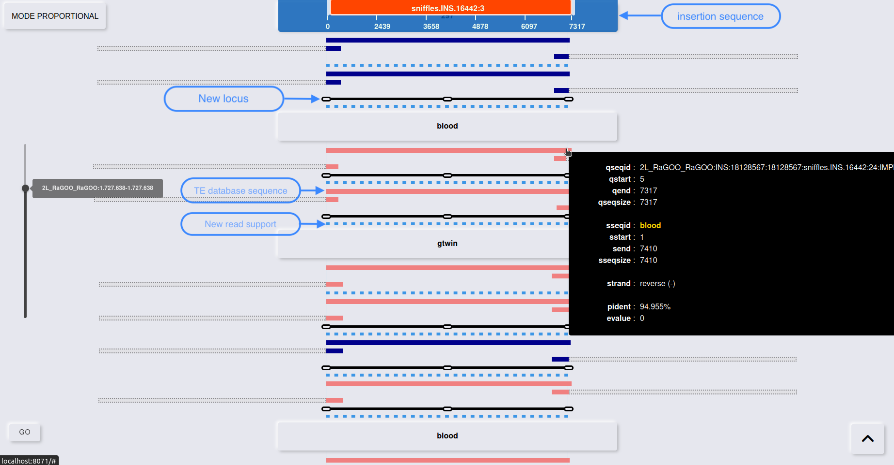

# MODULE ANALYSYS TE BLAST

This module enables the visualization of BLAST results concerning the newly detected transposable element insertions. It allows for the visual identification of specific structures such as LTR recombinations, transposable elements (TEs) inserted within other TEs, or more complex structures like clusters of TEs. This tool is crucial for genomic researchers aiming to deeply analyze the dynamics of TE insertions.

## Run Build Data

Execute the module with the following command :

```
singularity exec TrEMOLO.simg TrEMOLO/modules/2-MODULE_TE_BLAST/server/scripts/buildData.sh <work-directory-path>
```

For running tests

```bash
#after running the following command 
# singularity exec TrEMOLO.simg snakemake --snakefile TrEMOLO/run.snk --configfile TrEMOLO/test/tmp_config.yml

# run test
singularity exec TrEMOLO.simg TrEMOLO/modules/2-MODULE_TE_BLAST/server/scripts/buildData.sh work_test
# this command will create a file work_test/data.json and a symbolic link to this file in TrEMOLO/modules/2-MODULE_TE_BLAST/server/back-end/data/data_GEN.json
```


**Limit : the size of the `YOUR_WORK_DIRECTORY/data.json` file must not exceed 500MB**


## RUN SERVER

```bash
#get dependancies
singularity exec TrEMOLO.simg npm install blessed

#run
singularity exec TrEMOLO.simg bash TrEMOLO/module start 2
```

You can change the PORT numbers in the `TrEMOLO/modules/2-MODULE_TE_BLAST/server/config.yaml` file

To open the viewer go to the link in the client section.


## Viewer





This interface is designed for the vertical visualization of BLAST results, highlighting transposon insertion sequences. Black bars denote genomic locus changes, while blue dotted lines indicate a read support change within the same locus. Red or pink bars mark reverse-oriented insertion sequences, with blue for forward orientation. Translucent dotted segments represent unmatched areas with the TE or insertion sequence. The upper screen portion displays the insertion sequence complete with size indicators, and the lower portion presents the corresponding TE sequences from the database. The black vertical bar on the right allows tracking of the locus on the selected chromosome. Cursor movement and selecting "GO" enable navigation to a specific locus. Hovering over a sequence highlights the corresponding insertion sequence at the top, with its details displayed in a dedicated information block.
