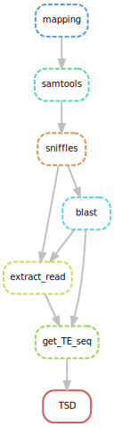

# TrEMOLO

*******
Content 
 1. [Configuration of the parameter file.](#config_file)
 2. [Start the pipeline.](#start_pipeline)

*******

## Require 

  * [Snakemake](https://snakemake-wrappers.readthedocs.io/en/stable/) 5.5.2
  * [Minimap2](https://github.com/lh3/minimap2) 2.16+
  * [Samtools](http://www.htslib.org/) 1.10+
  * [Sniffles](https://github.com/fritzsedlazeck/Sniffles) 1.0.10+
  * [Biopython](https://biopython.org/)
  * [Pandas](https://pandas.pydata.org/)
  * [Numpy](https://numpy.org/)

<div id='config_file'/> 

## Configuration of the parameter file 

You will first have to enter your parameters in a **.json** file (see example config.json file). The necessary parameters are:

```
{
    "work_directory": "/path/to/directory_work",
    "genome": "/path/to/genome_file.fasta",
    "read": "/path/to/reads_file.fastq",
    "name_out": "prefix_of_name_files_out",
    "fasta_TE": "/path/to/database_TE.fasta"
}
```

👉 ***You can pass absolute or relative paths.*** 👍

* **work_directory** : directory that will contain the output files (if the directory does not exist it will be created).
* **genome** : Genome assembly
* **read** : File containing the reads of genome assembly.
* **name_out** : Choice of the prefix or suffix of the majority of the output files.
* **fasta_TE** : File **.fasta** containing the sequence of transposable elements.

<div id='start_pipeline'/> 

## Start the pipeline

```
snakemake --snakefile /path/to/vrare.snk --configfile /path/to/your_config.json
```

👉 ***You can pass absolute or relative paths.*** 👍


### Summarize output files :open_file_folder:

Example of output file obtained after using the pipeline, in work directory.

```
├── ET_FIND_FA
│   ├── G73vsG73LR_find_17.6.fasta
│   ├── G73vsG73LR_find_297.fasta
│   ├── G73vsG73LR_find_412.fasta
│   ├── G73vsG73LR_find_blood.fasta
│   ├── G73vsG73LR_find_Burdock.fasta
│   ├── G73vsG73LR_find_copia.fasta
│   ├── G73vsG73LR_find_diver.fasta
│   ├── G73vsG73LR_find_flea.fasta
│   ├── G73vsG73LR_find_gtwin.fasta
│   ├── G73vsG73LR_find_HMS-Beagle.fasta
│   ├── G73vsG73LR_find_Max-element.fasta
│   ├── G73vsG73LR_find_mdg3.fasta
│   ├── G73vsG73LR_find_opus.fasta
│   ├── G73vsG73LR_find_Quasimodo.fasta
│   ├── G73vsG73LR_find_roo.fasta
│   ├── G73vsG73LR_find_rover.fasta
│   ├── G73vsG73LR_find_springer.fasta
│   ├── G73vsG73LR_find_Transpac.fasta
│   └── G73vsG73LR_find_ZAM.fasta
├── FASTA_FIND
│   ├── reads_2L_RaGOO_RaGOO:10077:10091462-10098788.fasta
│   ├── reads_2L_RaGOO_RaGOO:10077:10091462-10098788.fasta.fai
│   ├── reads_2L_RaGOO_RaGOO:10077:10091462-10098788.fasta.nhr
│   ├── reads_2L_RaGOO_RaGOO:10077:10091462-10098788.fasta.nin
│   ├── reads_2L_RaGOO_RaGOO:10077:10091462-10098788.fasta.nsq
│   ├── reads_2L_RaGOO_RaGOO:1024:897326-904652.fasta
│   ├── reads_2L_RaGOO_RaGOO:1024:897326-904652.fasta.fai
│   ├── reads_2L_RaGOO_RaGOO:1024:897326-904652.fasta.nhr
│   ├── reads_2L_RaGOO_RaGOO:1024:897326-904652.fasta.nin
│   ├── reads_2L_RaGOO_RaGOO:1024:897326-904652.fasta.nsq
│   ├── ...
├── G73vsG73LR.bam
├── G73vsG73LR_cnTE_ALL_ET.csv
├── G73vsG73LR_cnTE_ALL_ET_hit_map.csv
├── G73vsG73LR_cnTE.bln
├── G73vsG73LR_MD.sorted.bam
├── G73vsG73LR_sniffle.fasta
├── G73vsG73LR_sniffle.fasta.fai
├── G73vsG73LR.sorted.bam
├── G73vsG73LR_total_find.fasta
├── G73vsG73LR.vcf
├── READ_FASTQ_G73vsG73LR
│   ├── reads_2L_RaGOO_RaGOO:10077:10091462-10098788.fastq
│   ├── reads_2L_RaGOO_RaGOO:1024:897326-904652.fastq
│   ├── reads_2L_RaGOO_RaGOO:10273:10309986-10317318.fastq
│   ├── ...
├── REGION_RD_G73vsG73LR
│   ├── reads_2L_RaGOO_RaGOO:10077:10091462-10098788.txt
│   ├── reads_2L_RaGOO_RaGOO:1024:897326-904652.txt
│   ├── reads_2L_RaGOO_RaGOO:10273:10309986-10317318.txt
│   ├── reads_2L_RaGOO_RaGOO:11769:12063423-12070758.txt
│   ├── reads_2L_RaGOO_RaGOO:11994:12341312-12349689.txt
│   ├── ...
└── TSD
    ├── total_results_tsd_17.6.txt
    ├── total_results_tsd_297.txt
    ├── total_results_tsd_412.txt
    ├── ...
```

In directory **ET_FIND_FA** you can found fasta files of all sequences TE by familyof TE


The output file whose name ends with "cnTE_ALL_ET.csv" contains the following informations :

| sseqid | qseqid | pident | size_per | size_el | mismatch | gapopen | qstart | qend | sstart | send | evalue | bitscore |
| ------ | ------ | ------ | -------- | ------- | -------- | ------- | ------ | ---- | ------ | ---- | ------ | -------- |
| ZAM | 2R:\<INS\>:12136769:12145149:33748:4:IMPRECISE | 95.494 | 99.0 | 8347 | 123 | 178 | 5 | 8352 | 8435 | 1 | 0.0 | 13369.0 |
| blood | 3R:\<INS\>:22519173:22526514:100924:1:PRECISE | 94.259 | 99.0 | 7338 | 164 | 189 | 3 | 7341 | 7410 |  1 | 0.0 | 11230.0 |

##### Description of header .csv file :

 1.    `qseqid` :   query (e.g., gene) sequence id
 2.    `sseqid` : subject (e.g., reference genome) sequence id
 3.    `pident` :  percentage of identical matches
 4.    `size_per`    :   percentage of size TE
 5.    `size_el` :  size sequence TE aligned
 6.    `mismatch` : number of mismatches
 7.    `gapopen` :  number of gap openings
 8.    `qstart` :  start of alignment in query
 9.    `qend`  : end of alignment in query
 10.   `sstart`   : start of alignment in subject
 11.   `send`   : end of alignment in subject
 12.   `evalue`   : expect value
 13.   `bitscore`   : bit score

You can find the description here : [http://www.metagenomics.wiki/tools/blast/blastn-output-format-6](http://www.metagenomics.wiki/tools/blast/blastn-output-format-6)

##### Description of format qseqid or header of fasta files  :

chromosome:type_variant:start_position:end_position:ID:NB_read_support:PRECISE_OR_IMPRECISE_POSITION_SV
3R:\<INS\>:22519173:22526514:100924:1:PRECISE

 1.    `chromosome` : the name of the chromosome
 2.    `type_variant` : type of variant (insertion, deletion, duplication...) provided by sniffle in the **vcf** file
 3.    `start_position` : 5' position of the TE on the chromosome
 4.    `end_position`  : 3' position of the TE on the chromosome
 5.    `ID` : a uniq id of variant provided by sniffle in the **vcf** file
 6.    `NB_read_support` : number of reads supports
 7.    `PRECISE_OR_IMPRECISE_POSITION_SV` : indicates if the location of the TE is precise or imprecise


Note : if you want to use the scripts individually know that the format **qseqid** is a format necessary for most scripts in the pipeline. The header of some fasta files must also be in this format. This info is extracted from a vcf file (generate by Sniffle with the appropriate options).

In directory **FASTA_FIND**, **REGION_RD_G73vsG73LR**, **READ_FASTQ_G73vsG73LR** the format of name file is : 

reads_chromosome:ID:start_position:end_position.(txt|fastq|fasta)


##### Diagram of the different stages (rules)



Enjoy :+1:


