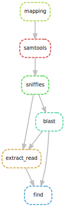

# Pipeline minority variants

*******
Content 
 1. [Configuration of the parameter file.](#config_file)
 2. [Start the pipeline.](#start_pipeline)

*******

## Require 

  * [Snakemake](https://snakemake-wrappers.readthedocs.io/en/stable/) 5.5.2
  * [Minimap2](https://github.com/lh3/minimap2) 2.16+
  * [Samtools](http://www.htslib.org/) 1.10+
  * [Sniffles](https://github.com/fritzsedlazeck/Sniffles) 1.0.10+
  * [Biopython](https://biopython.org/)
  * [Pandas](https://pandas.pydata.org/)
  * [Numpy](https://numpy.org/)

<div id='config_file'/> 

## Configuration of the parameter file 

You will first have to enter your parameters in a **.json** file (see example config.json file). The necessary parameters are:

```
{
    "work_directory": "/path/to/directory_work",
    "genome": "/path/to/genome_file.fasta",
    "read": "/path/to/reads_file.fastq",
    "name_out": "prefix_of_name_files_out",
    "fasta_TE": "/path/to/database_TE.fasta"
}
```

👉 ***You can pass absolute or relative paths.*** 👍

* **work_directory** : directory that will contain the output files (if the directory does not exist it will be created).
* **genome** : Genome assembly
* **read** : File containing the reads of genome assembly.
* **name_out** : Choice of the prefix or suffix of the majority of the output files.
* **fasta_TE** : File **.fasta** containing the sequence of transposable elements.

<div id='start_pipeline'/> 

## Start the pipeline

```
snakemake --snakefile /path/to/vrare.snk --configfile /path/to/your_config.json
```

👉 ***You can pass absolute or relative paths.*** 👍


### Summarize output files :open_file_folder:

Example of output file obtained after using the pipeline, in work directory.

```
├── ET_FIND_FA
│   ├── G73vsG73LR_find_17.6.fasta
│   ├── G73vsG73LR_find_297.fasta
│   ├── G73vsG73LR_find_412.fasta
│   ├── G73vsG73LR_find_blood.fasta
│   ├── G73vsG73LR_find_Burdock.fasta
│   ├── G73vsG73LR_find_copia.fasta
│   ├── G73vsG73LR_find_diver.fasta
│   ├── G73vsG73LR_find_flea.fasta
│   ├── G73vsG73LR_find_gtwin.fasta
│   ├── G73vsG73LR_find_HMS-Beagle.fasta
│   ├── G73vsG73LR_find_Max-element.fasta
│   ├── G73vsG73LR_find_mdg3.fasta
│   ├── G73vsG73LR_find_opus.fasta
│   ├── G73vsG73LR_find_Quasimodo.fasta
│   ├── G73vsG73LR_find_roo.fasta
│   ├── G73vsG73LR_find_rover.fasta
│   ├── G73vsG73LR_find_springer.fasta
│   ├── G73vsG73LR_find_Transpac.fasta
│   └── G73vsG73LR_find_ZAM.fasta
├── FASTA_FIND
│   ├── reads_2L_RaGOO_RaGOO:10077:10091462-10098788.fasta
│   ├── reads_2L_RaGOO_RaGOO:10077:10091462-10098788.fasta.fai
│   ├── reads_2L_RaGOO_RaGOO:10077:10091462-10098788.fasta.nhr
│   ├── reads_2L_RaGOO_RaGOO:10077:10091462-10098788.fasta.nin
│   ├── reads_2L_RaGOO_RaGOO:10077:10091462-10098788.fasta.nsq
│   ├── reads_2L_RaGOO_RaGOO:1024:897326-904652.fasta
│   ├── reads_2L_RaGOO_RaGOO:1024:897326-904652.fasta.fai
│   ├── reads_2L_RaGOO_RaGOO:1024:897326-904652.fasta.nhr
│   ├── reads_2L_RaGOO_RaGOO:1024:897326-904652.fasta.nin
│   ├── reads_2L_RaGOO_RaGOO:1024:897326-904652.fasta.nsq
│   ├── ...
├── G73vsG73LR.bam
├── G73vsG73LR_cnTE_ALL_ET.csv
├── G73vsG73LR_cnTE_ALL_ET_hit_map.csv
├── G73vsG73LR_cnTE.bln
├── G73vsG73LR_MD.sorted.bam
├── G73vsG73LR_sniffle.fasta
├── G73vsG73LR_sniffle.fasta.fai
├── G73vsG73LR.sorted.bam
├── G73vsG73LR_total_find.fasta
├── G73vsG73LR.vcf
├── Gene_G73onG0corrected_ragoo_full.bln
├── HISTO
│   ├── G73vsG73LR_cnTE_ALL_ET_17.6_histo.pdf
│   ├── G73vsG73LR_cnTE_ALL_ET_297_histo.pdf
│   ├── G73vsG73LR_cnTE_ALL_ET_412_histo.pdf
│   ├── ...
├── PICLUSTER
│   ├── G73onG0corrected_ragoo_IN_CLUSTER_COV_hit_map.csv
│   ├── Gene_G73onG0corrected_ragoo_combine.csv
│   └── PiCluster_Gene_G73onG0corrected_ragoo.csv
├── READ_FASTQ_G73vsG73LR
│   ├── reads_2L_RaGOO_RaGOO:10077:10091462-10098788.fastq
│   ├── reads_2L_RaGOO_RaGOO:1024:897326-904652.fastq
│   ├── reads_2L_RaGOO_RaGOO:10273:10309986-10317318.fastq
│   ├── ...
├── REGION_RD_G73vsG73LR
│   ├── reads_2L_RaGOO_RaGOO:10077:10091462-10098788.txt
│   ├── reads_2L_RaGOO_RaGOO:1024:897326-904652.txt
│   ├── reads_2L_RaGOO_RaGOO:10273:10309986-10317318.txt
│   ├── reads_2L_RaGOO_RaGOO:11769:12063423-12070758.txt
│   ├── reads_2L_RaGOO_RaGOO:11994:12341312-12349689.txt
│   ├── ...
└── TSD
    ├── total_results_tsd_17.6.txt
    ├── total_results_tsd_297.txt
    ├── total_results_tsd_412.txt
    ├── ...
```

##### Diagram of the different stages (rules)



Enjoy :+1:


